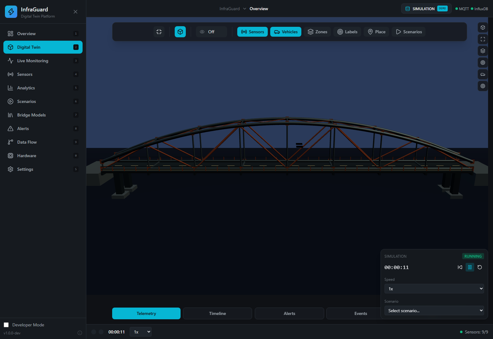
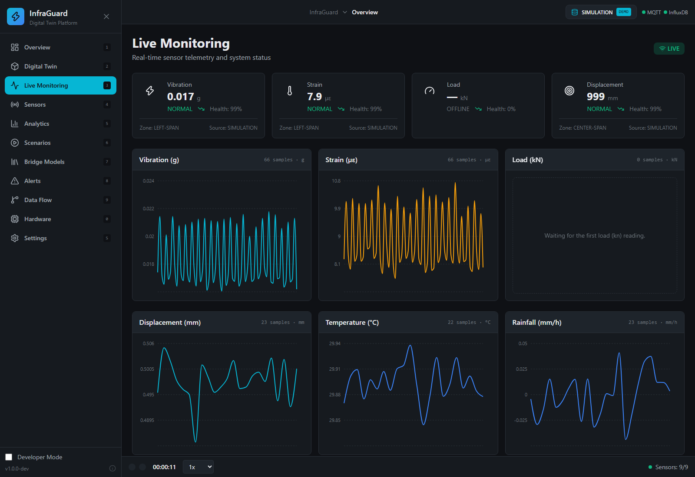
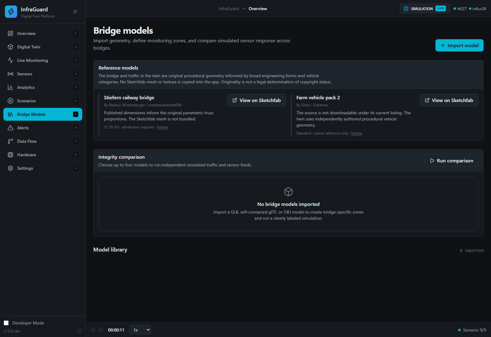

# InfraGuard

**An interactive bridge digital-twin demo for exploring synthetic sensor telemetry, traffic scenarios, alerts, and imported bridge geometry.**

[](https://infraguard-twin-github.vercel.app)
[](./LICENSE)

**Source repository:** [tjmhmdaarif/Infraguard---Bridge-Health-Monitoring-Syste-](https://github.com/tjmhmdaarif/Infraguard---Bridge-Health-Monitoring-Syste-)

> **Demo and engineering-data notice:** InfraGuard currently runs a browser-side simulation. It is not connected to a real MQTT broker, InfluxDB instance, bridge sensors, or structural-analysis solver. Telemetry, alerts, comparisons, and integrity indicators are illustrative only; they are not safety assessments or certified engineering results.

## Live demo

- **Application:** [infraguard-twin-github.vercel.app](https://infraguard-twin-github.vercel.app)
- **Digital twin:** [Open the 3D bridge](https://infraguard-twin-github.vercel.app/digital-twin)
- **Live monitoring:** [View telemetry and charts](https://infraguard-twin-github.vercel.app/live-monitoring)
- **Bridge models:** [View model import and comparison](https://infraguard-twin-github.vercel.app/bridge-models)

## Screenshots

Screenshots below show the deployed application. The Digital Twin displays the original procedural bridge; charts show example telemetry generated by the simulation.

### Interactive 3D digital twin



### Live monitoring



### Bridge models



## What you can explore

- **Digital Twin:** Inspect the procedural truss bridge, orbit and zoom the camera, switch views, and toggle sensor, vehicle, and zone overlays.
- **Simulation:** Change time speed and run traffic, weather, and structural-anomaly scenarios against synthetic telemetry.
- **Live Monitoring and Analytics:** View generated vibration, strain, displacement, temperature, and rainfall samples, plus sensor status and charts.
- **Alerts and Data Flow:** Explore simulated alert states and the illustrated telemetry-processing path.
- **Bridge Models:** Import OBJ, GLB, or self-contained glTF geometry in the browser, define zones, and compare model-specific simulated feeds.
- **Settings:** Store MQTT and database connection-profile details for configuration work; saving a profile does not establish a service connection.

The generated bridge and vehicles use original procedural geometry. Referenced Sketchfab pages are links only; their meshes and textures are not bundled with this app. Originality is not a legal determination of copyright status.

## Telemetry data guide

Values shown by the demo are generated by the simulation and can change as time advances or scenarios run.

| Reading | Display unit | Demo source / interpretation |
| --- | --- | --- |
| Vibration magnitude | g | Synthetic accelerometer reading; influenced by the configured scenario and traffic. |
| Strain | µε | Synthetic strain-gauge reading; illustrative structural response. |
| Load | kN | Available for load-cell telemetry; a reading may be absent when no load-cell sample is generated. |
| Displacement / distance | mm | Synthetic distance/displacement reading; not a surveyed movement measurement. |
| Temperature | °C | Synthetic environmental sensor reading. |
| Rainfall | mm/h | Synthetic rain-sensor reading, affected by simulated weather. |
| Health, anomaly, and alert status | score / status | Rule-based demo indicators; not a diagnosis or engineering certification. |

The demo does **not** provide a validated finite-element model (FEA), calibration against a real bridge, persistent cloud telemetry storage, or an operational MQTT/InfluxDB backend. Do not use its output to make inspection, maintenance, or public-safety decisions.

## Run locally

Requirements: Node.js 20 or later and npm.

```powershell
npm ci
npm run dev
```

Vite prints the local development URL. The deployed demo is a static Vite frontend; simulation state runs in the browser.

### Production bundle

```powershell
npm exec -- vite build
npm run preview
```

`npm run build` also runs `tsc -b` before Vite. The current codebase has existing TypeScript errors, so the Vercel deployment uses the Vite bundle command directly. The bundle build is not a substitute for a passing type check.

## Technology

- React 19, TypeScript, and Vite
- Three.js with React Three Fiber and Drei
- Zustand state stores
- Recharts telemetry visualizations
- Tailwind CSS and CSS variables
- Framer Motion interface transitions

## Data, imports, and privacy

- The live deployment currently generates synthetic demo data in the browser; it does not ingest real sensor readings.
- MQTT and InfluxDB fields are saved as configuration profiles only. No credentials should be entered into a public demo.
- Imported model files are read in the browser and represented with temporary object URLs. They are not uploaded to a project backend and do not persist across reloads.
- Model comparisons use separate illustrative simulations. They do not calculate certified bridge-integrity or safety results.

## Deployment

The public demo is hosted on [Vercel](https://vercel.com). `vercel.json` configures `npm ci`, a Vite production build, the `dist` output directory, and SPA route rewrites.

To create your own deployment, import this repository in Vercel and use the checked-in project configuration. Do not add secrets as `VITE_*` variables: Vite embeds those values into public frontend assets.

## License

This project is distributed under the MIT License; see [LICENSE](./LICENSE).
